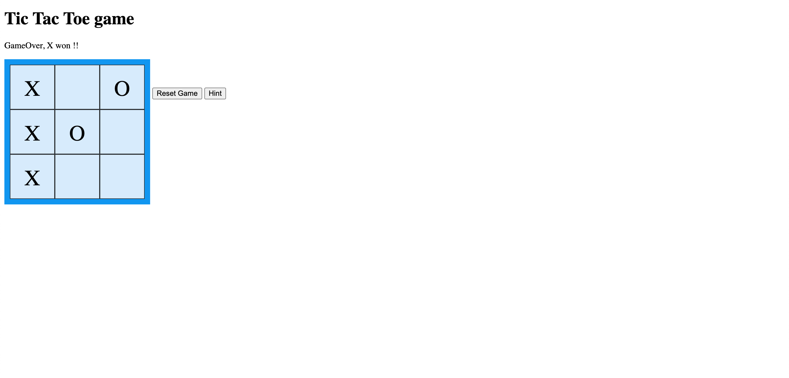

# TicTacToe

Simple Tic Tac Toe game played entirely in the backend.
Every time a user interacts with the game, a POST request is 
sent to backend, which dictates the game's state and logic. After a 
user plays, a new dynamic HTML file is then sent to the client 
with the updated game.

There is also an option to request a hint, in which case I implemented
a basic version of von Neumann's MinMax algorithm.

## How to use

- Clone the repository
- Run */src/tictactoe.go*
- Open your favorite web browser on http://localhost:8000
